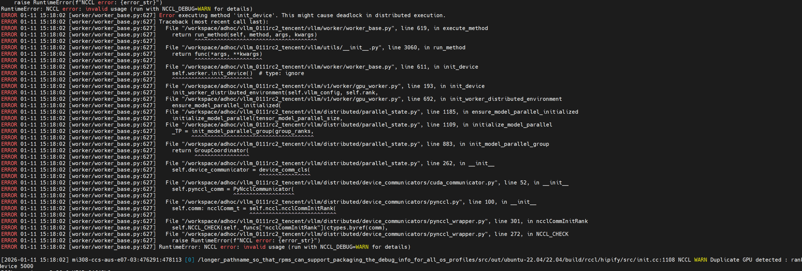
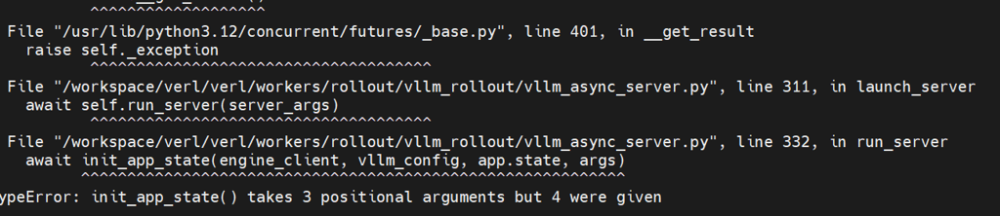
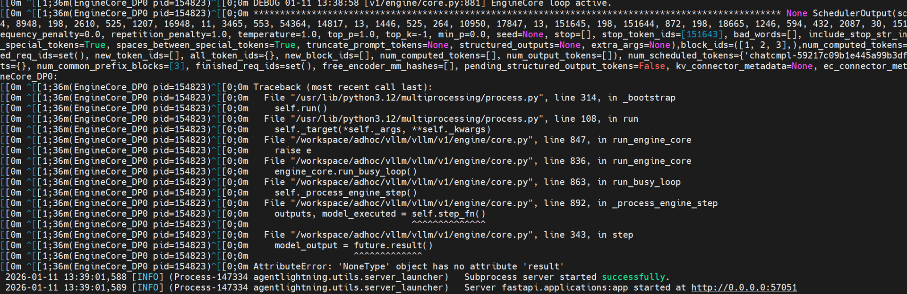

## verl/vllm 版本问题汇总
| verl/vllm | 0.10.2 | 0.11.0（精度有问题） | 0.11.2（async server 问题，已解决） |
|---|---|---|---|
| 0.5.0   必碰到init device问题（已解决）  | retool: 【error】 executing method 'init device'    * init device 问题可以通过两个patch来来解决，详见下方| * retool: 【error】ModuleNotFoundError: No module named 'vllm.model_executor.sampling_metadata'   * 修复后同样 'init device' error   * init device 问题可以通过两个patch来来解决，详见下方| -  |
|0.5.0-484-g2c062202（镜像默认）   retool 接口有问题，修复后没问题   | retool: compute_score() got an unexpected keyword argument 'reward_router_address'  <已解决>   | retool: compute_score() got an unexpected keyword argument 'reward_router_address'  <已解决>   |  retool 【直接运行会碰到model-hosting-container-standards  from vllm.utils import FlexibleArgumentParser, get_tcp_uri， init_app take 3 position问题，修复后，同样 async server error https://github.com/volcengine/verl/issues/4308#issuecomment-3594293427  <已解决>  |
| 0.6.0  | verl retool: 【error】ExternalZeroMQDistributedExecutor.collective_rpc() got an unexpected keyword argument 'non_block' <已解决>  |   |   |
| 0.7.0  | retool: TypeError: cannot pickle '_contextvars.ContextVar' object   <未解决>   |  retool: TypeError: cannot pickle '_contextvars.ContextVar' object   <未解决> |   |
|   |   |   |   |

## init device 问题

1. 修改ray和vllm,见下面code ，可以去掉RAY_EXPERIMENTAL_NOSET_HIP_VISIBLE_DEVICES=1 环境变量
2.  在verl/workers/rollout/vllm_rollout/vllm_rollout_spmd.py +476禁用monkey patch可以解决compute_logits问题。 
3. 通过 https://github.com/volcengine/verl/issues/4308#issuecomment-3594293427 可以解决collective_rpc重载non_block问题

vllm.patch
~~~~
diff --git a/vllm/platforms/rocm.py b/vllm/platforms/rocm.py
index c96df8d65..90d5d41b9 100644
--- a/vllm/platforms/rocm.py
+++ b/vllm/platforms/rocm.py
@@ -360,8 +360,9 @@ class RocmPlatform(Platform):
     @classmethod
     @lru_cache(maxsize=8)
     def get_device_capability(cls, device_id: int = 0) -> Optional[DeviceCapability]:
-        major, minor = torch.cuda.get_device_capability(device_id)
-        return DeviceCapability(major=major, minor=minor)
+        #major, minor = torch.cuda.get_device_capability(device_id)
+        #return DeviceCapability(major=major, minor=minor)
+        return DeviceCapability(major=9, minor=4)
 
     @classmethod
     @with_amdsmi_context
@@ -485,7 +486,8 @@ class RocmPlatform(Platform):
     @cache
     def is_fp8_fnuz(cls) -> bool:
         # only device 0 is checked, this assumes MI300 platforms are homogeneous
-        return "gfx94" in torch.cuda.get_device_properties(0).gcnArchName
+        return True
+        #return "gfx94" in torch.cuda.get_device_properties(0).gcnArchName
 
     @classmethod
     def fp8_dtype(cls) -> torch.dtype:
@@ -499,9 +501,10 @@ class RocmPlatform(Platform):
     @classmethod
     def use_custom_allreduce(cls) -> bool:
         # We only enable custom allreduce for MI300 series
-        gcn_arch = torch.cuda.get_device_properties(0).gcnArchName
-        supported_archs = ["gfx94", "gfx95"]
-        return any(gfx in gcn_arch for gfx in supported_archs)
+        #gcn_arch = torch.cuda.get_device_properties(0).gcnArchName
+        #supported_archs = ["gfx94", "gfx95"]
+        #return any(gfx in gcn_arch for gfx in supported_archs)
+        return "gfx94"
 
     @classmethod
     def opaque_attention_op(cls) -> bool:

~~~~

ray.patch
~~~~
diff --git a/python/ray/_private/accelerators/amd_gpu.py b/python/ray/_private/accelerators/amd_gpu.py
index 997d095f24..5d15f16572 100644
--- a/python/ray/_private/accelerators/amd_gpu.py
+++ b/python/ray/_private/accelerators/amd_gpu.py
@@ -48,14 +48,6 @@ class AMDGPUAcceleratorManager(AcceleratorManager):
             )
 
         env_var = HIP_VISIBLE_DEVICES_ENV_VAR
-        if (cuda_val := os.environ.get(CUDA_VISIBLE_DEVICES_ENV_VAR, None)) is not None:
-            if (hip_val := os.environ.get(HIP_VISIBLE_DEVICES_ENV_VAR, None)) is None:
-                env_var = CUDA_VISIBLE_DEVICES_ENV_VAR
-            elif hip_val != cuda_val:
-                raise ValueError(
-                    f"Inconsistent values found. Please use either {HIP_VISIBLE_DEVICES_ENV_VAR} or {CUDA_VISIBLE_DEVICES_ENV_VAR}."
-                )
-
         return env_var
 
     @staticmethod
@@ -131,6 +123,10 @@ class AMDGPUAcceleratorManager(AcceleratorManager):
             AMDGPUAcceleratorManager.get_visible_accelerator_ids_env_var()
         ] = ",".join([str(i) for i in visible_amd_devices])
 
+        os.environ[
+            CUDA_VISIBLE_DEVICES_ENV_VAR
+        ] = ",".join([str(i) for i in visible_amd_devices])
+
     @staticmethod
     def _get_amd_device_ids() -> List[str]:
         """Get the list of GPUs IDs

~~~~

## compute_score() 接口问题
修改 verl/experimental/reward/reward_loop/naive.py 用下面code 覆盖
~~~~
async def run_single(self, data: DataProto) -> dict:
        assert len(data) == 1, "Only support single data item"
        data_item = data[0]
        response_ids = data_item.batch["responses"]
        response_length = response_ids.shape[-1]
        valid_response_length = data_item.batch["attention_mask"][-response_length:].sum()
        valid_response_ids = response_ids[:valid_response_length]
        data_source = data_item.non_tensor_batch["data_source"]
        ground_truth = data_item.non_tensor_batch["reward_model"]["ground_truth"]
        extra_info = data_item.non_tensor_batch.get("extra_info", {})
        tool_extra_fields = data_item.non_tensor_batch.get("tool_extra_fields", None)
        if tool_extra_fields is not None:
            extra_info.update(tool_extra_fields.items())
        num_turns = data_item.non_tensor_batch.get("__num_turns__", None)
        rollout_reward_scores = data_item.non_tensor_batch.get("reward_scores", {})
        extra_info["num_turns"] = num_turns
        extra_info["rollout_reward_scores"] = rollout_reward_scores
        response_str = await self.loop.run_in_executor(
            None, lambda: self.tokenizer.decode(valid_response_ids, skip_special_tokens=True)
        )
        extra_reward_kwargs = (
            {
                "reward_router_address": self.reward_router_address,
                "reward_model_tokenizer": self.reward_model_tokenizer,
            }
            if self.reward_router_address is not None
            else {}
        )
        if self.is_async_reward_score:
            result = await self.compute_score(
                data_source=data_source,
                solution_str=response_str,
                ground_truth=ground_truth,
                extra_info=extra_info,
                **extra_reward_kwargs,
            )
        else:
            result = await self.loop.run_in_executor(
                None,
                lambda: self.compute_score(
                    data_source=data_source,
                    solution_str=response_str,
                    ground_truth=ground_truth,
                    extra_info=extra_info,
                    **extra_reward_kwargs,
                ),
            )
~~~~

## vllm>=0.10.0 接口问题/
ModuleNotFoundError: No module named 'vllm.model_executor.sampling_metadata'

~~~~
1.  -- verl/workers/rollout/vllm_rollout/vllm_rollout_spmd.py L52
# from vllm.worker.worker_base import WorkerWrapperBase
from vllm.v1.worker.worker_base import WorkerWrapperBase

2.  -- verl/workers/rollout/vllm_rollout/vllm_rollout_spmd.py
#from vllm.model_executor.sampling_metadata import SamplingMetadata 
from vllm.v1.sample.metadata import SamplingMetadata
~~~~

## vllm>=0.11.2 接口问题/

1. 手动pip install model-hosting-container-standards (vllm0.11.2 以上新增)
2. 函数位置发生变化，如下修改：
~~~~
# from vllm.utils import FlexibleArgumentParser, get_tcp_uri
from vllm.utils.argparse_utils import FlexibleArgumentParser
from vllm.utils.network_utils import get_tcp_uri
~~~~
3. 删掉 vllm_config
   

##  async server nonetype has no attribute 'result' /'non_block' 问题

通过 https://github.com/volcengine/verl/issues/4308#issuecomment-3594293427 可以解决collective_rpc重载non_block问题

